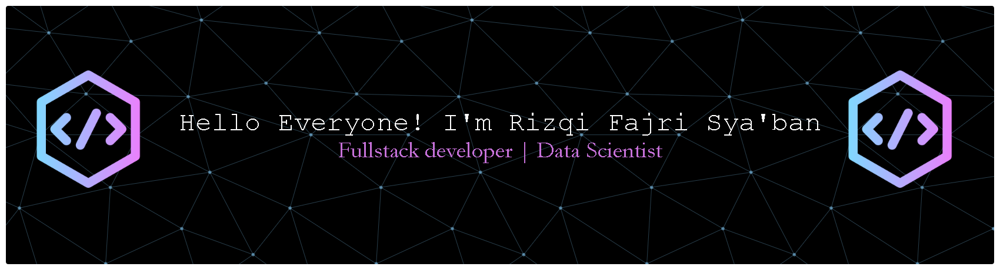

## Hello Everyone, I'm Rizqi Fajri Sya'ban 👋

### 💫 About Me:
- 🔭 I’m currently Studying at Multi Data Palembang University  - 🌱 I’m currently learning full-stack web Developer, Android Developer, Data Scientist, and Cyber security.

### 🌐 Socials:
   

### 💻 Tech Stack:
                
### 📊 GitHub Stats:
 
 

### 🏆 GitHub Trophies

### 🔝 Top Contributed Repo

---

<!-- Proudly created with GPRM ( https://gprm.itsvg.in ) -->
<!-- 
**rizqifajri25/rizqifajri25** is a ✨ _special_ ✨ repository because its `README.md` (this file) appears on your GitHub profile.

Here are some ideas to get you started:

- 🔭 I’m currently working on ...
- 🌱 I’m currently learning ...
- 👯 I’m looking to collaborate on ...
- 🤔 I’m looking for help with ...
- 💬 Ask me about ...
- 📫 How to reach me: ...
- 😄 Pronouns: ...
- ⚡ Fun fact: ...
-->
<!-- - 🔭 I’m currently Studying at Multi Data Palembang University

- 🌱 I’m currently learning full-stack web Developer, Android Developer, Data Scientist, and Cyber security.

##### Skills
 -->

<!-- 

 -->

<!-- ##### Connect With Me
  -->

<!--   -->

<!-- ##### My Github Stats

 -->

